# Power Fitness

**A personal coaching platform for a real training business.** Members complete a fitness assessment and get an auto-generated 12-week workout and nutrition plan. A coach reviews and approves the plan, and members track their progress against it week by week.

[](https://github.com/Nourhene123/Power-Fitness/actions/workflows/ci.yml)


<!-- Live demo: add the link here once deployed -->

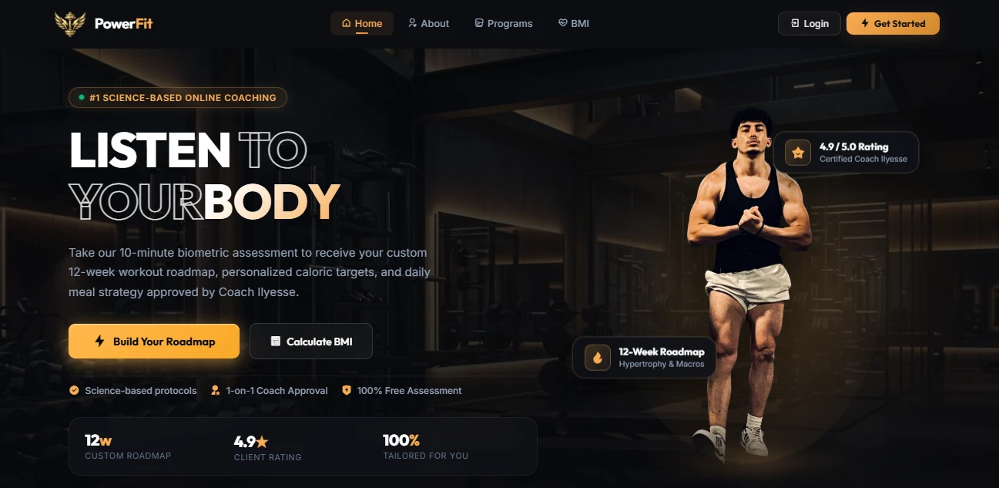

| Member: today's dashboard | Coach: automated analysis and at-risk flag |
|---|---|
| 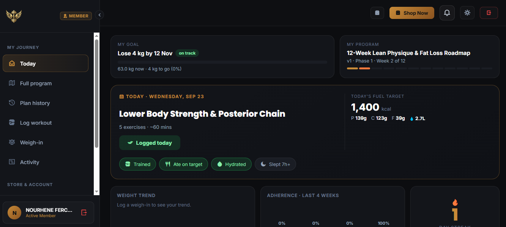 | 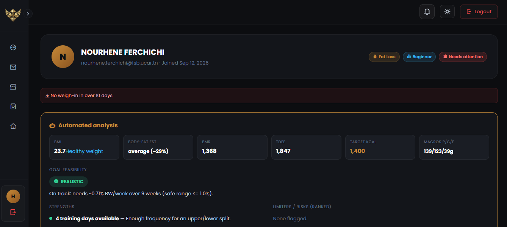 |

More screenshots are in the [gallery](#screenshots) below.

---

## Why this exists

My brother is a personal trainer. He ran his coaching business on a PHP/MySQL site that had reached its limits. Business logic lived inside the view scripts, there were no tests, and every new feature risked breaking something unrelated.

This repository rewrites it from scratch as a Spring Boot + Angular monorepo. It keeps the same end-to-end flow: **assessment → analysis → plan generation → coach review → member dashboard → progress tracking → shop**. The new architecture is built to hold as the business grows.

## Engineering highlights

- **The build enforces the architecture.** An [ArchUnit test](backend/src/test/java/com/powerfitness/ArchitectureTest.java) fails CI if a controller touches the data layer directly. Controllers only see DTOs.
- **Plan generation is deterministic and unit-tested.** A 7-step intake feeds a rule-based feasibility and constraint analyzer, which drives the 12-week plan generator. These are framework-free domain classes (`AssessmentAnalyzer`, `RoadmapGenerator`) with their own test suites.
- **Auth is stateless.** JWT access tokens plus hashed refresh tokens that are rotated and can be revoked. There are three roles: `USER`, `COACH` and `ADMIN`.
- **Plans have a versioned review workflow.** A coach can approve a plan, request changes, or edit and republish it. Every version is kept, with a plain-language changelog between versions.
- **At-risk detection gives reasons.** Clients are flagged for a stale weigh-in, no recent workout, or low habit adherence, and the specific reason is shown next to the flag.
- **Schema changes go through migrations.** Every schema change is a Flyway migration, never ad-hoc SQL.
- **Three test layers.** Unit tests (JUnit and Mockito) and integration tests against a real Postgres (Testcontainers) run in GitHub Actions on every push and PR, alongside the frontend build and tests. End-to-end browser tests (Playwright) run locally.

## Features

| Area | What it does |
|---|---|
| **Assessment & plan** | 7-step intake wizard → feasibility analysis → auto-generated 12-week workout and nutrition plan |
| **Coach workflow** | Review queue, dynamic plan editor, version history, per-client profile with 30-day history, at-risk flags |
| **Member dashboard** | Workout logging, weigh-ins, daily habit tracking, merged activity timeline, plan history |
| **Shop** | Cash-on-delivery catalog, cart, checkout, order history, product and order admin with image upload |
| **Coach requests** | Public "request a coach" form feeding an admin/coach queue |
| **Notifications** | In-app updates when a plan, order or request changes status |

## Screenshots

Every dashboard has a collapsible sidebar and a dark/light theme.

### Public site

| Programs page | Sign in | Register |
|---|---|---|
| 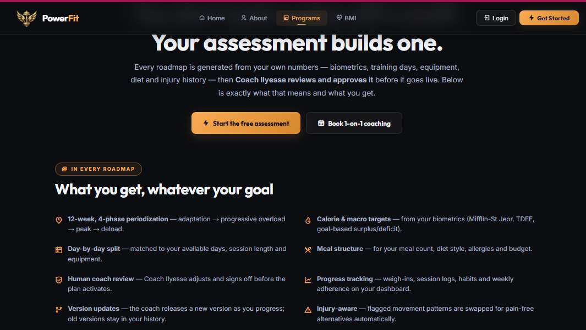 | 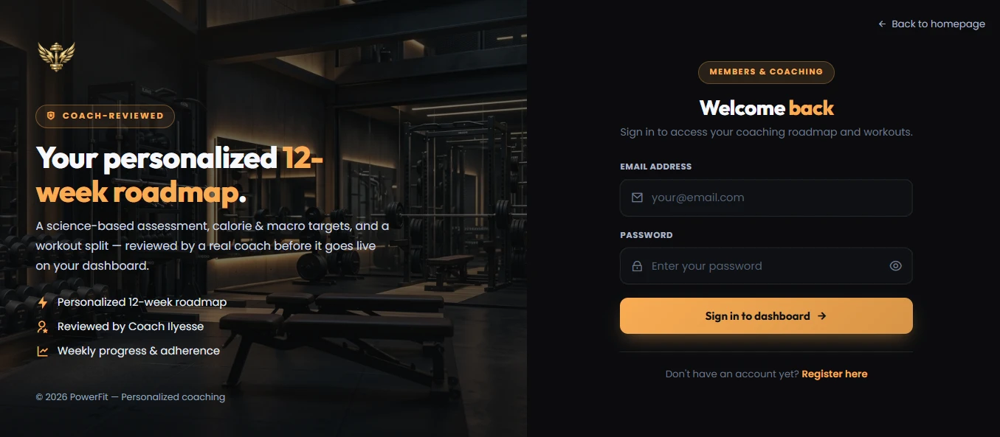 | 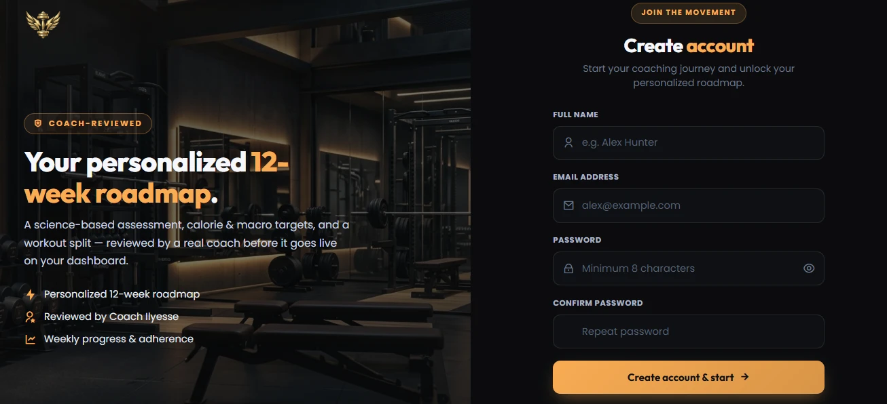 |

### Member

**Assessment wizard (step 2 of 7: body and biometrics).** The answers feed the feasibility analysis and the generated 12-week plan.

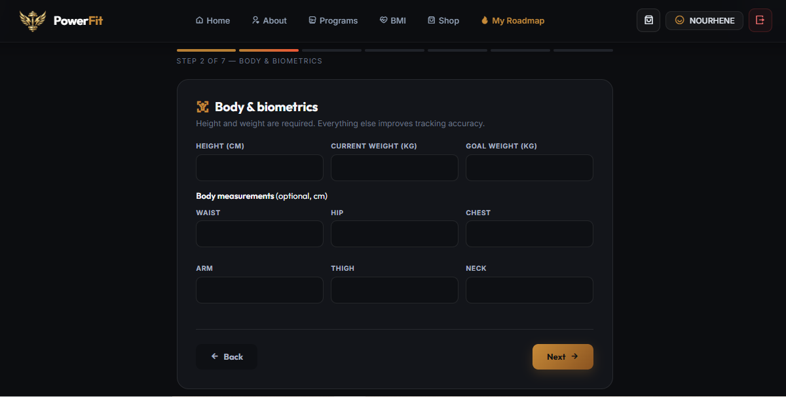

| Full program: 12-week progression and daily fuel targets (dark) | Full program: workout split and meals (light) |
|---|---|
| 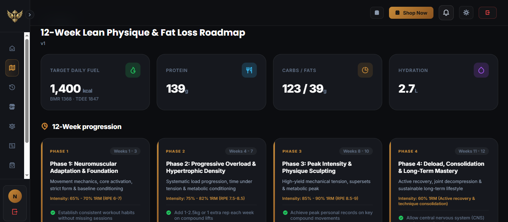 | 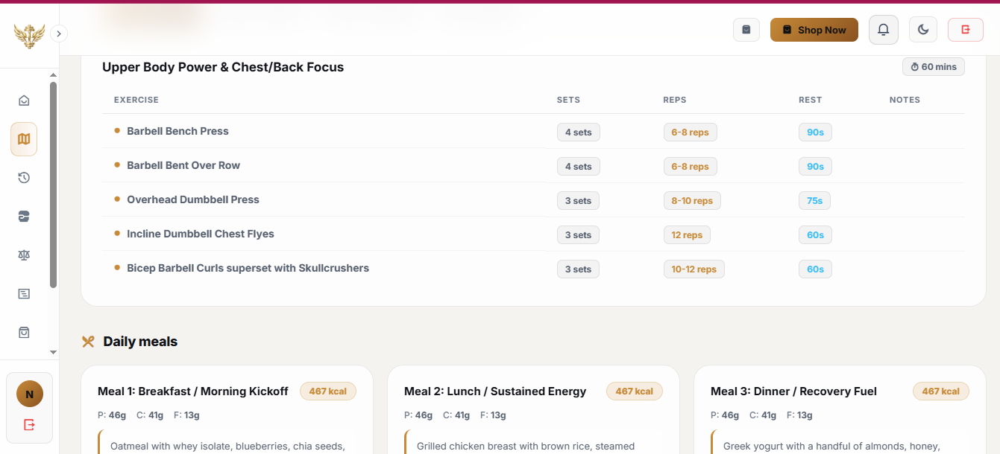 |

### Coach

| Roadmap review queue | Client assessment data and progression phases |
|---|---|
| 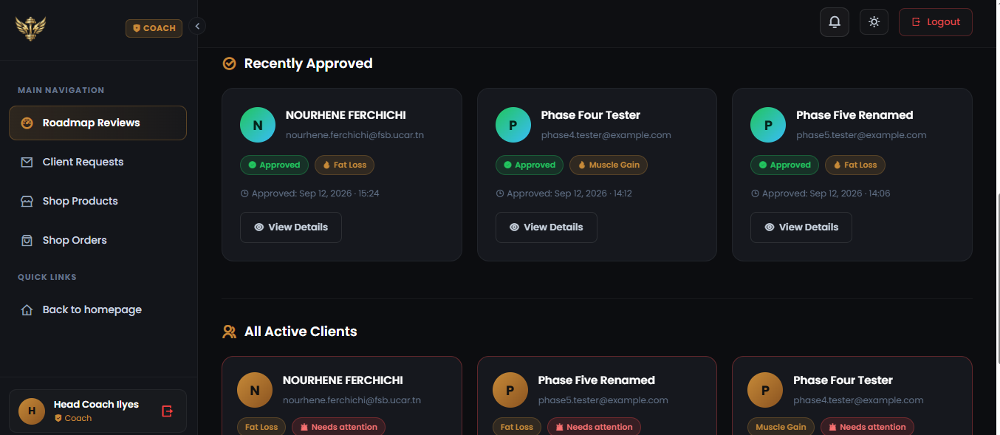 | 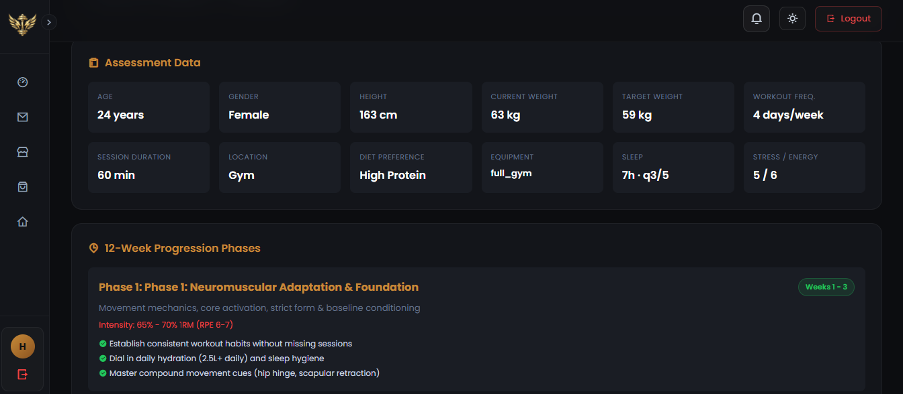 |
| **Plan review: weekly workout split (light)** | **Shop order management** |
| 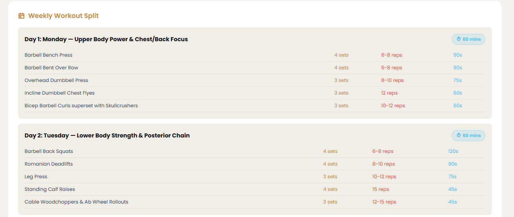 | 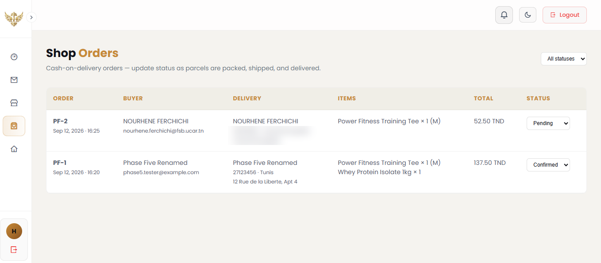 |

## Architecture

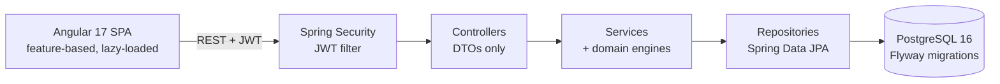

- **The backend is organised by layer.** It has packages for controllers, services, repositories, entities, DTOs, MapStruct mappers, security, exceptions and config, so each class's role is clear from its package. Errors are handled by an `ApiException` hierarchy that returns a uniform JSON error body.
- **The frontend is organised by feature**, the opposite split on purpose: all the code for a screen lives together. It has `core/` (auth, guards, interceptors, cart, notifications), `shared/`, `layout/` (public, auth, member and coach shells), and one lazy-loaded folder per feature under `features/`.

The reasoning behind each choice is in the Architecture sections of [backend/README.md](backend/README.md#architecture) and [frontend/README.md](frontend/README.md#architecture).

## Tech stack

| Layer | Technologies |
|---|---|
| Backend | Java 17, Spring Boot 4, Spring Security (JWT), Spring Data JPA, MapStruct, Flyway |
| Frontend | Angular 17 (standalone components), TypeScript, SCSS design system, light and dark mode |
| Database | PostgreSQL 16 |
| Testing | JUnit 5, Mockito, Testcontainers, MockMvc, ArchUnit, Karma/Jasmine, Playwright |
| DevOps | Docker Compose, GitHub Actions CI |

## Quick start

**Prerequisites:** JDK 17, Node 20+, Docker.

```bash
# 1. Database (published on host port 5433)
docker compose up -d db

# 2. Backend -> http://localhost:8080  (dev profile by default)
cd backend && ./mvnw spring-boot:run

# 3. Frontend -> http://localhost:4200
cd frontend && npm install && npm start
```

To run the whole stack in containers instead, use `docker compose --profile full up --build`. For a database UI, use `docker compose --profile tools up -d pgweb` and open http://localhost:8081.

**Demo accounts** (seeded only under the `dev` profile):

| Role | Email | Password |
|---|---|---|
| Coach | `coach@powerfitness.com` | `PowerCoach123!` |
| Admin | `admin@powerfitness.com` | `PowerAdmin123!` |

To try the member flow, register a new account. It takes you straight to the assessment.

## Testing

| Layer | Tools | What it proves |
|---|---|---|
| Unit | JUnit 5, Mockito | Business logic is correct in isolation |
| Integration | Testcontainers, MockMvc | HTTP → Spring Security → service → **real Postgres** work together |
| Architecture | ArchUnit | The layer boundaries hold |
| End-to-end | Playwright | A real browser can use the real app against the real backend |

```bash
cd backend  && ./mvnw verify        # unit + integration + architecture (needs Docker)
cd frontend && npm test             # Angular unit tests
cd frontend && npm run test:e2e     # Playwright (needs db + backend running)
```

**What's covered:** auth (registration, login, refresh-token rotation and revocation), assessment analysis, plan generation, client risk scoring, and the program workflow.

Output from a `./mvnw verify` run: **80 backend tests, all passing.**

```
Tests run:  7  -- com.powerfitness.ArchitectureTest
Tests run:  1  -- com.powerfitness.PowerFitnessApplicationTests
Tests run: 11  -- com.powerfitness.controller.AuthControllerIntegrationTest        (Testcontainers)
Tests run: 20  -- com.powerfitness.service.AssessmentAnalyzerTest
Tests run: 10  -- com.powerfitness.service.RoadmapGeneratorTest
Tests run:  8  -- com.powerfitness.service.AuthServiceImplTest
Tests run:  8  -- com.powerfitness.service.RefreshTokenServiceImplTest
Tests run: 11  -- com.powerfitness.service.ProgramServiceImplIntegrationTest     (Testcontainers)
Tests run:  4  -- com.powerfitness.service.ClientRiskServiceImplIntegrationTest  (Testcontainers)

Tests run: 80, Failures: 0, Errors: 0, Skipped: 0
BUILD SUCCESS
```

The Playwright tests cover login and role-based routing: a coach lands on `/coach`, a new member lands on `/assessment`, a bad login shows an error, and an unauthenticated user is redirected to login. See [frontend/e2e/README.md](frontend/e2e/README.md) for setup.

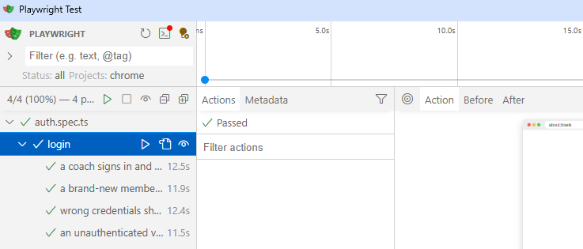

## Documentation

- [docs/API.md](docs/API.md): endpoint reference
- [docs/DEPLOYMENT.md](docs/DEPLOYMENT.md): what a production deployment needs
- [docs/SMOKE_TEST.md](docs/SMOKE_TEST.md): manual acceptance checklist
- [backend/README.md](backend/README.md) and [frontend/README.md](frontend/README.md): detailed architecture, feature map and known gotchas

## Roadmap

- [ ] Public live demo
- [ ] Run Playwright in CI
- [ ] Extend Playwright coverage to the assessment → plan → coach approval flow
- [ ] Email notifications alongside the in-app ones
